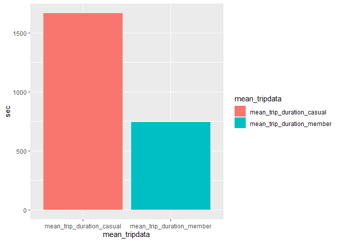
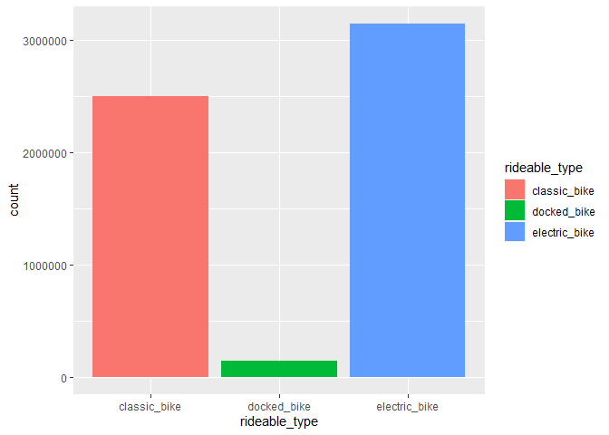
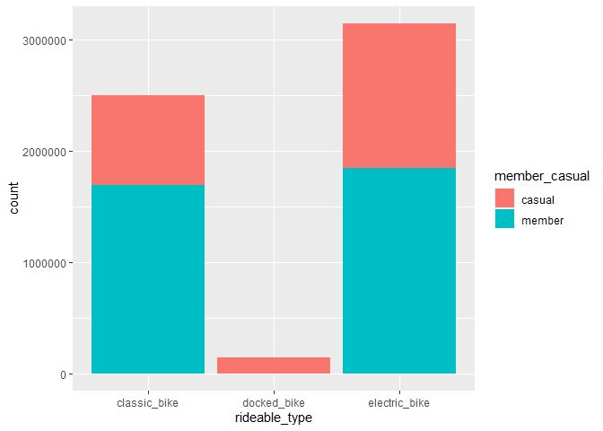
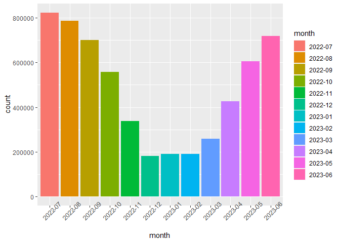
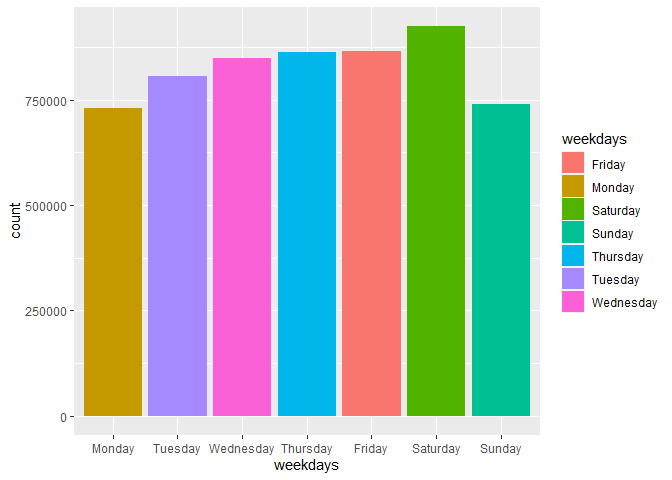

Cyclistics_Company_Case_Study
================
Kiruthika Paranthaman
2023-08-10

## Cyclistic Bike Share Analysis Case study

Cyclistic Bike Share Analysis case study is a part of Google Analytics
Certificate Course Capstone Project.Cyclistic is a bike sharing Company
with 5824 bicycles and 692 Docking stations in Chicago. Company wants to
maximize the number of annual memberships from its existing Casual
riders.

Data Source : <https://divvy-tripdata.s3.amazonaws.com/index.html> July
2022 to June 2023 (12 Months) License : Motivate International Inc. user
license

## Business Task

- Analyse how do Annual members and Casual riders use Cyclistic Bike
  differently

## Hypothesis/Questions guiding this case study

Following are the hypothesis made while starting this analysis,

- Members will ride more trip duration than casual members
- Rides will be more in weekends and there might be seasonal increase in
  rides during certain months
- Which bike type is loved by riders?

## Coding and Analysis

The Case study has been completed on Rstudio Desktop version.Analysis
and recommendations is based on 12 month tripdata (July 2022 to June
2023 - Total 57,79,444 Observations)downloaded from the specified data
source link mentioned above. There are two type of riders - Casual,
Members(who paid membership fees) and three types of bikes : Classic,
Electric and Docked Bike in the company

## Installing Necessary Packages and library

Tidyverse is a package specifically designed for Data manipulation ,
Exploration and Visualization.Lets Install the necessary packages and
library- tidyverse,dplyr,readr,lubridate and ggplot2

``` r
#install.packages("tidyverse")
#install.packages("dplyr")
#install.packages("readr")
#install.packages("lubridate")
#install.packages("ggplot2")
library(tidyverse)
library(dplyr)
library(readr)
library(lubridate)
library(ggplot2)
```

## Importing and merging 12 month data

Loading separate csv files from July 2022 to June 2023 from desktop and
combining them into single data file using bind_rows() function. Lets
call the merged file as “tripdata”

``` r
tripdata <- list.files(path="~/my project/data/",full.names=TRUE) %>%
  lapply(read_csv) %>%
  bind_rows()
```

Lets find the column names

``` r
colnames(tripdata)
```

    ##  [1] "ride_id"            "rideable_type"      "started_at"        
    ##  [4] "ended_at"           "start_station_name" "start_station_id"  
    ##  [7] "end_station_name"   "end_station_id"     "start_lat"         
    ## [10] "start_lng"          "end_lat"            "end_lng"           
    ## [13] "member_casual"

Add new column named duration_sec to find trip duration for each ride in
seconds

``` r
tripdata <-tripdata %>% mutate(duration_sec=ended_at-started_at)
```

Finding mean duration of both casual riders and member riders

``` r
mean_trip_duration_casual <- tripdata %>% filter(member_casual=="casual")%>%
  summarize(mean_casual=mean(duration_sec))

mean_trip_duration_member <- tripdata %>% filter(member_casual=="member")%>%
  summarize(mean_member=mean(duration_sec))
```

## Analysis 1 : Mean Trip data

``` r
df<- data.frame(mean_tripdata=c("mean_trip_duration_casual","mean_trip_duration_member"),
                sec=c(as.numeric(paste0(mean_trip_duration_casual)),as.numeric(paste0(mean_trip_duration_member))))
ggplot(data=df)+geom_col(mapping=aes(x=mean_tripdata,y=sec,fill=mean_tripdata))
```

<!-- -->

Casual members ride more duration than membership holders and hence the
hypothesis made initially that members will ride more trip duration has
been falsified

### Finding count of casual rides greater than mean_member trip duration of 743

Mean trip duration of members is 743. Lets find count of how many casual
riders ride more than this, which can be used as target rides for
conversation to annual membership

``` r
count_freq_casual <- tripdata %>% filter(member_casual=="casual",duration_sec>743)%>%
  count()
count_freq_casual
```

    ## # A tibble: 1 × 1
    ##         n
    ##     <int>
    ## 1 1089292

## Analysis 2 :Finding frequently used bike type by both members and casuals

``` r
options(scipen=999)
p<-ggplot(data=tripdata)+geom_bar(mapping=aes(x=rideable_type,fill=rideable_type))
p
```

<!-- -->

Classic bike and Electric bike seems to be the most used bike category

## Analysis 3 : Finding frequently used bike type by casual members

Here options (scipen=999) has been used to display ggplot y axis count
in numerical instead of scientific notation

``` r
options(scipen=999)
g<-ggplot(data=tripdata)+geom_bar(mapping=aes(x=rideable_type,fill=member_casual))
g
```

<!-- -->

Members use both classic bike and electric bike equally whereas casual
members give more preference to electric bike. Docked bike though
minimal was predominantly preferred by casual members

## Analysis 4 : Finding riders user pattern month wise with start-date

Create a new column named month with year and month to find month wise
pattern

``` r
j <- tripdata %>% mutate(month=format(started_at,"%Y-%m"))%>% arrange(month)

options(scipen=999)

users_trend_plot <- j %>% ggplot()+geom_bar(mapping=aes(x=month,fill=month))+
  theme(axis.text.x=element_text(angle=45))

users_trend_plot
```

<!-- -->

Ride count high for six months from May to October.Highest rides can be
observed during July month.Ride count decreases from November.Lowest
ride count for three months from December to February. Increasing ride
counts from March.If campaign is to be run, it is to be run during six
months from May to October particularly during July month when maximum
ride counts is observed

## Analysis 5 : Finding riders pattern during weekdays and weekends

Create a new column named weekdays specifying the days of rides

``` r
w <- j %>% mutate(weekdays=weekdays(started_at))%>% arrange(weekdays)
weekdays_order <- c('Monday','Tuesday', 'Wednesday','Thursday','Friday','Saturday','Sunday')

weekday_pattern <- w %>% ggplot()+ geom_bar(mapping=aes(x=weekdays,fill=weekdays))+
  scale_x_discrete(limits=weekdays_order)

weekday_pattern
```

<!-- -->

No predominant pattern can be observed as ride count is almost equal for
all days. highest rides in Saturday and lowest during Monday.

## Conclusion

Based on the analysis, following conclusions has been arrived,

- Mean trip duration of membership holders is 743. There are 10,89,292
  rides taken by casual members which is more than the mean trip
  duration of 743 by membership members. This 10,89,292 rides taken by
  casual members can be the initial target for the campaign as these are
  the high duration trips and has high potential to be converted to
  membership members.

- Campaign if run will reach maximum riders if run particularly in July
  month or during six months from May to October

- Electric bike is the most used bike type by casual members. Docked
  bike though lowest preferred bike type was predominantly preferred by
  casual members.Discounts/campaigns can be designed for electric bike
  and Docked bike to maximize the conversion from casual to members

- Campaign can be run on any days as no particular pattern could be
  observed. Though No phenomenal difference Saturday has highest ride
  counts and Monday is the lowest comparatively
